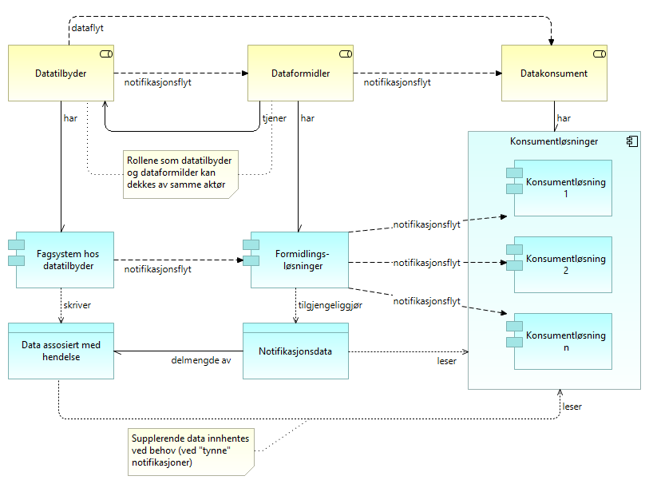
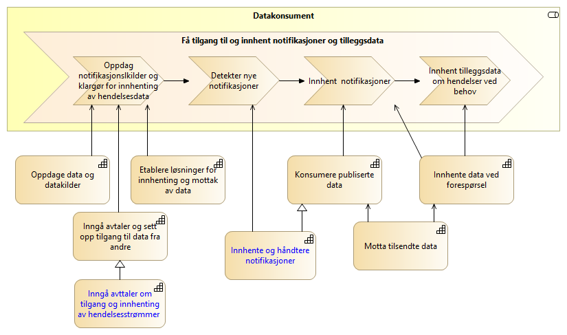
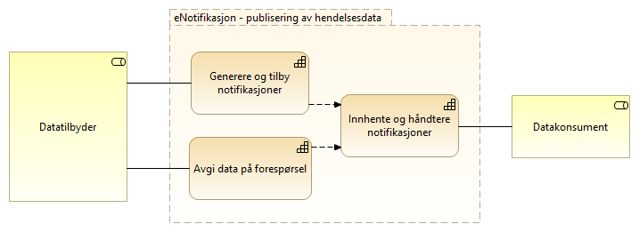
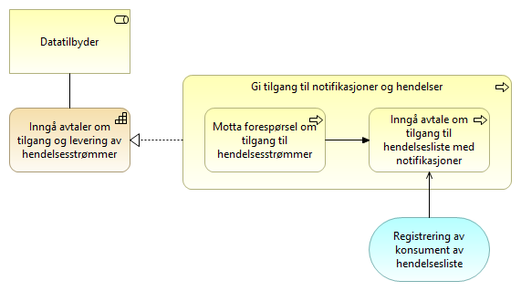
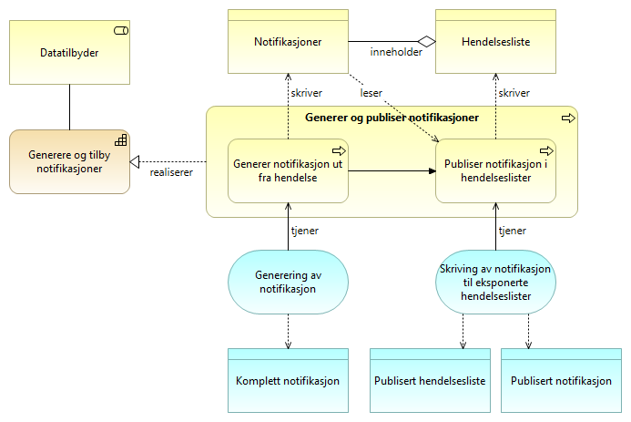
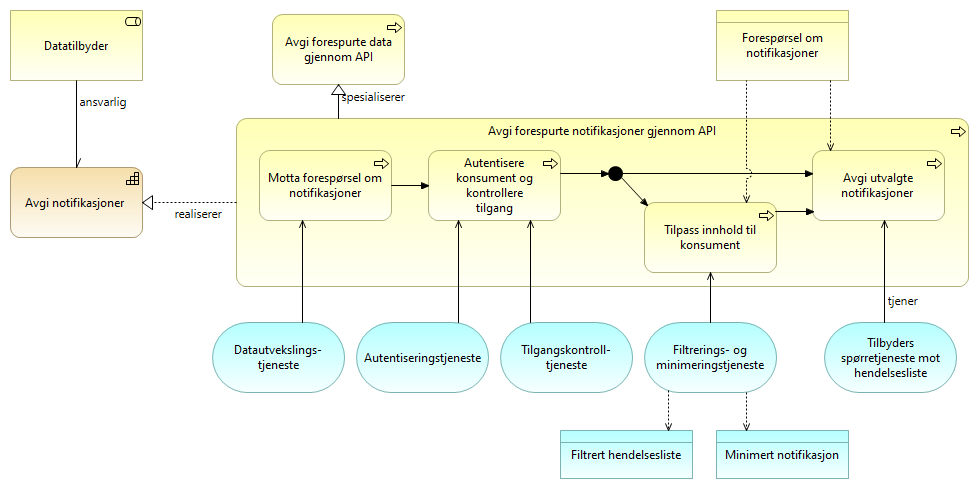
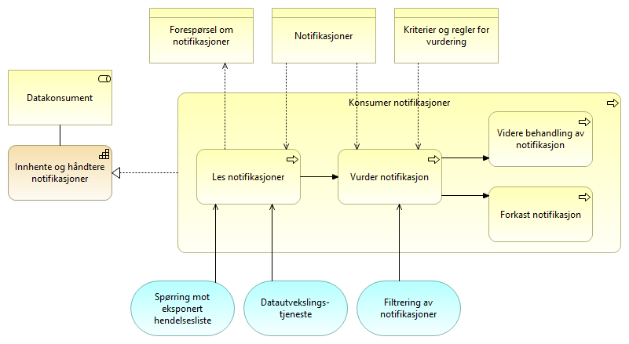

:lang: no
:doctitle: eNotifikasjon arkitekturmønster
:keywords: eNotifikasjon

include::../plattform_felles/includes/commonincludes.adoc[]

[.lead]
//eNotifikasjon er en referansearkitektur for publisering av hendelsesdata med løs kopling mellom tilbyder og konsument. 

//image:../plattform_felles/media/i-arbeid.png[width=45, height=45] _I arbeid (høst 2019)_

//== Introduksjon
//include::../nab_referanse_arkitekturer_enotifikasjon/ra-enotifikasjon-intro.adoc[]

== Om dette mønsteret

=== Grunnleggende mønstre

Arkitekturmønsteret eNotifikasjon bygger på _grunnleggende mønstre for publisering og strømming av hendelser_. 

Det tas videre utganspunkt i konsepter fra _Event Sourcing_, et anerkjent og mye omtalt arkitekturmønster.

.Event sourcing - overordnet konsept
****
Event Sourcing er et arkitekturmønster hvor tilstanden til et "subjekt" bestemmes gjennom en sekvens av hendelser som lagres i kronologisk rekkefølge, ut fra et gitt startpunkt.

Detaljer om dette mønsteret finnes under   <<litteraturhenvisninger-event-sourcing,litteraturhenvisninger om event sourcing>>
****

=== Egenskaper

Grunnleggende egenskaper ved eNotifikasjon som mønster:

* En hendelse kan representeres ved en eller flere  _notifikasjoner_.
* Notifikasjoner samles i _hendelseslister_.
* Hendelser kan ikke slettes (_immutable_), og notifikasjoner slettes heller ikke fra hendelseslister.  
* Notifikasjoner innhentes på initiav fra konsument (pull).
* Hver enkelt konsument kan lese samme notifikasjon flere ganger.  
* Hendelseslister kan traverseres og spørres mot.

== Innhold i notifikasjoner (eNotifikasjon)

Dette er en konkretisering av <<notifikasjonsinnhold-generisk,generisk notifikasonsinnholdet>>. Begrepsapparatet bygger på <<grunnleggende-begreper,det grunnleggende begrepsapparatet for publisering av hendelsesstrømmer>>.

En modell for notifikasjonsinnholdet for _eNotifikasjon_ er vist i figuren nedenfor. Her er det også angitt  relasjonene til _hendelsesrelaterte data_, noe som kan være et langt større datasett enn det som utveksles i notifikasjoner mellom tilbyder og konsument.

Overordnet:

En notifikasjon inneholder som minimum en _identifikator for notifikasjon_, slik at det er mulig å identifisere assosierte hendelsesrelaterte data.
Det er normalt hensiktsmessig å inkludere en spesifikasjon av hendelsestype.
I tilknytning tli eNotifikasjon vil det bestandig kunne assosieres et subjekt (eventuel en samling), og en vil være interessert i å ta rede på status og historikk.

//image:../plattform_felles/media/i-arbeid.png[width=45, height=45] #_Innarbeiding av kommentarer pågår, 2020-04-27_#

// For mønsteret eNotifikasjon gjelder en detaljering av begrepet _hendelsesrelaterte data_ som følger her.

.Innhold i notifikasoner for mønsteret eNotifikasjon
image::../nab_referanse_arkitekturer_datautveksling_publisering/media/Innhold i notifikasoner for mønsteret eNotifikasjon.png[alt=Innhold i notifikasoner for mønsteret eNotifikasjon image]

Forklaring til modellen:

 
* _Hendelsesrelaterte data_ kan være små eller store datasett som kan identifiseres og assosieres med en notifikasjon. Det komplette datasettet for dette kan ligge samlet, eller det kan være distribuert over flere lagringsløsninger og virksomheter. 

* _Notifikasjon_ kan inneholde et fullstendig sett av _hendelsesrelaterte data_, men dette er i mange tilfeller ikke hensiktsmessig. Alternativet er å la konsumentene komme tilbake og be om supplerende data. 

* _Identifikator for notifikasjon_ identifiserer notifikasjonen entydig for eller overfor tilbyder. Konsumenten kan bruke denne identifikatoren i spørringer for å innhente supplerende hendelsesrelaterte data om en mottatt notifikasjon. 

// * _Supplerende notifikasjonsdata_ er relevant når den den leverte notifikasjonen ikke inneholder   f.eks. uproblematisk å sende med en ny måleverdi for et termometer, mens det kan være mindre ønskelig å distribuere komplette kopier av større og distribuerte datasett. Hensynet til dataminimering spiller også en rolle i slike vurderinger.

* _Hendelsestype_ kan være et entydig element i et kontrollert vokabular, men det kan også være "fritekst".

* _Subjekt for hendelse_ vil identifisere subjektet, dvs. hvem eller hva hendelsen omhandler, slik dette er å oppfatte i den aktuelle konteksten. Dette kan være en person, et fysisk objekt, en samling av personer eller fysiske objekter, eller et konsept.

* _Øyeblikksbilde for subjekt etter hendelse_ kan være f.eks. en målerutlesning fra en sensor. Det kan også være f.eks. innholdet i en større database.

* _Inkrementell endring i øyeblikksbilde av subjekt_ gir både historikk og statis for aktuelle subjekter.   

//Notifikasjoner kan inneholde et fullstendig sett av _hendelsesrelaterte data_,  men dette er i mange tilfeller ikke hensiktsmessig. Alternativet er å la konsumentene komme tilbake og be om _supplerende data_. Det er f.eks. uproblematisk å sende med en ny måleverdi for et termometer, mens det kan være mindre ønskelig å distribuere komplette kopier av større og distribuerte datasett. Hensynet til dataminimering spiller også en rolle i slike vurderinger.

////
For å kunne filtrere og minimere innholdet i supplerende hendelsesdata gjennom spørringer, må konsumenten kjenne datamodellen for _hendelsesrelaterte data_.

Merk: Det totale datasettet for hendelsesrelaterte data kan eventuelt være sammensatt og ligge distribuert. Det vil også kunne lenke til relaterte datasett som ikke ses på som en direkte del av det aktuelle datasettet.  

TIP: Globalt unike identifikatorer kan fungere som direkte pekere til aktuelle dataressurser på nettet. Med spørrespråk som SPARQL of GraphQL kan slike ressurser finnes direkte, uten å gå veien om tilbyder.

////

////
Grunnleggende begreper og sammenhenger er vist i følgende modell. 

.eNotifikasjon - grunnleggende begreper
image::../nab_referanse_arkitekturer_enotifikasjon/media/eNotifikasjon - grunnleggende begreper.png[alt=eNotifikasjon - grunnleggende begreper image]

_Hendelser_ er det som skjer i den virkelige i verden, i en strøm av hendelser, eller __hendelsesstrømmer__. 

_Notifikasjoner_ gir informasjon om hendelser, og kan distribueres via _hendelseslister_ (på engelsk brukes begrepet __topics__) til den som måtte være interessert.

I tilknytning til hver hendelse finnes _Hendelsesdata_. Dette kan være små eller store _Datasett_, enten lagret samlet eller lagret distribuert i flere ulike lagringsløsninger (polyglot persistence).

Notifikasjoner kan inneholde _komplette hendelsesdata_,  men dette er i mange tilfeller ikke hensiktsmessig. Alternativet er å la konsumentene komme tilbake og be om _supplerende data_. Det er f.eks. uproblematisk å sende med en ny måleverdi for et termometer, mens det kan være mindre ønskelig å distribuere komplette kopier av større og distribuerte datasett. Hensynet til dataminimering spiller også en rolle i slike vurderinger.

Begrepet _klassifisering_ benyttes her om ulike typer metadata om datasettet som kan gi grunnlag for dataminimering, f.eks. at det inneholder persondata. Dette gjelder både for hendelsesdata og det _øyeblikksbildet_ (eller instansen av datasettet) som forelå da hendelsen inntraff og som forbindes med notifikasjonen.
////

////
For notifikasjoner som ikke gir det komplette _øyeblikksbildet_, må datakonsumenten avgjøre om det behøves supplerende data, og selv ta initiativ til å innhente de dataene det er behov for.

Hvordan konsumenten identifiserer aktuelle supplerende hendelsesdata, kan variere. En mulighet er at notifikasjonen inneholder en peker til det aktuelle datasettet, dvs. øyeblikksbildet, og at dette gjøres gjennom en _identifikator for øyeblikksbilde av datasett_. Selve datasettet, og instansen av datasettet, kan eventuelt være sammensatt og ligge distribuert. Det vil også kunne lenke til relaterte datasett som ikke ses på som en direkte del av det aktuelle datasettet (og der det kan være vanskelig å garantere at det finnes et konsistent øyeblikksbilde).

TIP: En globalt unik identifikator kan fungere som en direkte peker til aktuelle dataressurser på nettet. En kan da, under visse forutsetninger, unngå behovet for å måtte innhente kopier av supplerende data, også for data som ligger hos andre virksomheter og eventuelt distribuert hos flere virksomheter. 
////

// Henrik Figur under er tatt ut og bør erstattes med figur uten formidler rollen og tilhørende komponenter.

////
== Aktørsamspill

Figuren nedenfor viser involverte roller og applikasjoner, samt samspillet mellom disse.

.eNotifikasjon - grunnleggende konsepter

Kommentarer til denne figuren:

* Rollen som _Dataformidler_ kan være ivaretatt av datatilbyder selv, uten et eksternt mellomledd. 

* _Formidlingsløsninger_ kan tilsvarende være ivaretatt av Datatilbyder selv, hva gjelder formidlingen av notifikasjoner. 

* _Formidlingsløsninger_ omfatter også løsning for metadatakatalog for å finne fram til datakilder, designtime og runtime. Dette er ikke eksplisitt vist her. Eksempel på løsning: Felles datakatalog. 

* _Dataflyt_ og _notifikasjonsflyt_ er å forstå som den logiske flyten av data og notifikasjoner. Om dette skjer på initiativ fra datakonsument (pull) eller datatilbyder (push), er en annen sak.

* _Notifikasjonsdata_ om hver enkelt hendelse finnes i _hendelseslister_ som kan leses og navigeres av datakonsumentene. 

* _Formidlingsløsninger_ kan være integrert i _Fagsystem hos datatilbyder_. 

* _Data assosiert med hendelse_ kan her antas å inneholde all relevant informasjon om aktuelle hendelser. Datakonsumentene må kunne gå tilbake til Datatilbyder for å innhente supplerende data i tilknytning til hver enkelt notifikasjon, ved behov. Avhengig av behovene, må aktuelle data kunne være tilgjengelige for gjentatt lesing, kanskje flere år fram i tid.    

////

== Verdistrømmer

=== eNotifikasjon - oversikt over verdistrømmer

Følgende figur viser en oversikt over verdistrømmene på tvers av datatilbyder og datakonsument for eNotifikasjon. 

.eNotifikasjon - oversikt over verdistrømmer
image::../nab_referanse_arkitekturer_enotifikasjon/media/eNotifikasjon - oversikt over verdistrømmer.png[alt=eNotifikasjon - oversikt over verdistrømmer image]

//Dette er en spesialisert utgave av tilsvarende #_felles referansemodell for datautveksling_#. 

Stegene i verdistrømmen er nærmere forklart under egne avsnitt om verdistrømmene for hver rolle.  

=== eNotifikasjon - verdistrøm for datatilbyder
Her vises verdistrømmen for eNotifikasjon sett fra datatilbyder, med angivelse av kapabiliteter.

Det som er spesifikt for eNotifikasjon er vist med uthevet skrift, dvs. _Inngå avtaler om tilgang og levering av hendelsesstrømmer_ og _Generere og tilby notifikasjoner_. Øvrige kapabiliteter er beskrevet andre steder, blant annet i tilknytning til referansearkitekturer for eMelding (Sende data) og  eOppslag (Avgi data på forespørsel).  

.eNotifikasjon - tilbyders verdistrøm
image::../nab_referanse_arkitekturer_enotifikasjon/media/eNotifikasjon - tilbyders verdistrøm.png[alt=eNotifikasjon - tilbyders verdistrøm image]

=== eNotifikasjon - verdistrøm for datakonsumenter
Her vises verdistrømmen for eNotifikasjon sett fra datakonsumenter, med angivelse av kapabiliteter.

Det som er spesifikt for eNotifikasjon er vist med uthevet skrift, dvs. _Inngå avtaler om tilgang og innhenting av hendelsesstrømmer_ og _Innhente og håndtere notifikasjoner_. Øvrige kapabiliteter er beskrevet andre steder, blant annet i tilknytning til referansearkitekturer for eMelding (Motta data) og  eOppslag (Innhente data ved forespørsel).  

.eNotifikasjon - konsumenters verdistrøm

== Kapabilitetskart for eNotifikasjon

Modellen under viser kapabiliteter som er spesifikke for eNotifikasjon. Øvrige kapabiliteter er beskrevet i samhandlingsmønsteret for _deling av data på forespørsel_.

.Kapabiliteter eNotifikasjon

//.Kapabiliteter eNotifikasjon
//image::../nab_referanse_arkitekturer_enotifikasjon/media/Kapabiliteter eNotifikasjon.png[alt=Kapabiliteter eNotifikasjon image]

[cols ="1,3", options="header"]
.Elementer i view for Kapabiliteter eNotifikasjon
|===

| Element
| Beskrivelse

| Datatilbyder
| Tilbyder av data til andre aktører.

| Datakonsument
| Den som innhenter eller mottar data fra andre aktører.

| Inngå avtaler om tilgang og levering av hendelsesstrømmer
| Evnen til å inngå avtaler med datakonsumenter om tilgengjengeliggjøring av hendelseslister med notifikasjoner om hendelser.

| Inngå avtaler om tilgang og innhenting av hendelsesstrømmer 
| Evnen til å inngå avtaler med datatilbyder om tilgang til hendelser gjennom hendelseslister med notifikasjoner.

| Avgi data på forespørsel
| Evnen til å avgi data på forespørsel

| Generere og tilby notifikasjoner
| Evnen til å dele informasjon om hendelser gjennom notifikasjoner som tilgjengeliggjøres for konsumenter gjennom hendelseslister.

| Innhente og håndtere notifikasjoner
| Evnen til å konsumere hendelseslister ved å innhente notifikasjoner.

|===

== Arkitekturmønstre
Arkitekturmønster for eNotifikasjon beskriver realiseringen av kapabilitetene som er spesifikke for dette mønsteret.

Beskrivelsene er forsøkt å holdes generisk uten å peke til løsningskomponenter, og det vil dermed kunne være flere måter å realisere de ulike elementene på.

=== Gi tilgang til notifikasjoner og hendelser
Gi tilgang til notifikasjoner og hendelser er den prosessen datatilbyder må gjøre for å gi datakonsumenten tilgang til hendelseslister. Ved helt åpne hendelseslister kan prosessen være unødvendig og utgår, men vil normalt omfatte å tilgjengeliggjøre API som beskrevet i eOppslag. I tillegg må det eventuelt registreres en del informasjon i tilknytning til filtrering og tilpassning av hendelselister etter konsumentens behov og tilganger.

.Gi tilgang til notifikasjoner og hendelser

[cols ="1,3", options="header"]
.Elementer i view for Gi tilgang til notifikasjoner og hendelser
|===

| Element
| Beskrivelse

| Datatilbyder
| Tilbyder av data til andre aktører.

| Inngå avtaler om tilgang og levering av hendelsesstrømmer
| Evnen til å inngå avtaler med datakonsumenter om tilgengjengeliggjøring av hendelseslister med notifikasjoner om hendelser.

| Motta forespørsel om tilgang til hendelsesstrømmer
| Prosessen med å motta forespørsel om tilgang til notifikasjoner på hendelseslister.

| Inngå avtale om tilgang til hendelsesliste med notifikasjoner
| Prosessen med å registrere seg som konsument av en hendelsesliste hos datatilbyder

| Registrering av konsument av hendelsesliste
| Tjeneste for å registrere konsumenter av hendelseslite med notifikasjoner.

|===

=== Få tilgang til notifikasjoner og hendelser
Få tilgang til notifikasjoner og hendelser er den prosessen datakonsument må gjøre for å sette opp og få tilganger til hendelseslister. Prosessetrinnene kommer i tillegg til prosessen for å få tigang til API som beskrevet i eOppslag.

.Få tilgang til notifikasjoner og hendelser
image::../nab_referanse_arkitekturer_enotifikasjon/media/Få tilgang til notifikasjoner og hendelser.png[alt="Bilde mangler", width=500]

[cols ="1,3", options="header"]
.Elementer i view for Få tilgang til notifikasjoner og hendelser
|===

| Element
| Beskrivelse

| Datakonsument
| Den som innhenter eller mottar data fra andre aktører.

| Inngå avtaler om tilgang og innhenting av hendelsesstrømmer 
| Evnen til å inngå avtaler med datatilbyder om tilgang til hendelser gjennom hendelseslister med notifikasjoner.

| Beskrive behov og tilganger
| Prosessen med å beskrive hvilke tilganger konsument har rettigeheter til og hvilken type notifikasjoner som er aktuelle. 

| Inngå avtale om tilgang til hendelsesliste med notifikasjoner
| Prosessen med å registrere seg som konsument av en hendelsesliste hos datatilbyder

| Registrering av konsument av hendelsesliste
| Tjeneste for å registrere konsumenter av hendelseslite med notifikasjoner.

|===

=== Generer og publiser notifikasjoner
Generer og publiser notifikasjoner er den prosessen datatilbyder må gjøre for å tilby notifikasjoner gjennom hendelseslister. Hendelselister tilbys på tilsvarende måte som beskrevet for generelle mønstre for spørring og oppslag (herunder eOppslag), men det finnes spesielle krav for hendelseslister med tanke på segmentering,  filtrering og navigering.

.Generer og publiser notifikasjoner 

[cols ="1,3", options="header"]
.Elementer i view for Generer og publiser notifikasjoner
|===

| Element
| Beskrivelse

| Datatilbyder
| Tilbyder av data til andre aktører.

| Generere og tilby notifikasjoner
| Evnen til å dele informasjon om hendelser gjennom notifikasjoner som tilgjengeliggjøres for konsumenter gjennom hendelseslister.

| Notifikasjoner
| Dataobjekt som peker til (eller representerer) en hendelse og gjøres tilgjengelig på en hendelsesliste så konsumenten får vite om hendelsen.

En notifikasjon kan inneholde lite eller mye informasjon om selve hendelsen, men det må være nok informasjon til at konsumenten kan vurdere om hendelsen er relevant for seg.

En notifikasjon inneholder også en referanse til hendelsen og relevante grunnlagsdata.

| Hendelsesliste
| Liste med notifikasjoner tilgjengelig for konsumenter. 

| Generer og publiser notifikasjoner
| Prosessen med å dele informasjon om hendelser.

| Generer notifikasjon ut fra hendelse
| Prosessen med å generere en notifikasjon på bakgrunn av en hendelse.

| Publiser notifikasjon i hendelseslister
| Prosessen med å legge notifikasjoner i en eller flere hendelseslister som er eksponert overfor aktuelle konsumenter.

| Generering av notifikasjon
| Tjeneste som genererer notifikasjoner basert på hendelser, der alle aktuelle grunnlagsdata er med eller lenket til.

| Skriving av notifikasjon til eksponerte hendelseslister
| Tjeneste for å skrive en notifikasjon til en eller flere hendelseslister, eventuelt med filtrering av informasjon ut fra hvem som er aktuelle konsumenter.

| Komplett notifikasjon
| Notifikasjon som inneholder et fullstendig sett av hendelsesrelaterte data.

| Publisert hendelsesliste
| Hendelsesliste som eksponeres for konsument. En tilbyder kan tilby flere hendelselister i parallell f.eks. med ulike temaer og for konsumenter med ulike rettigheter.

| Publisert notifikasjon
| Notifikasjon som publiseres på en eller flere hendelseslister. Publiserte notifikasjoner kan være tykke eller tynne med hensyn på hvor mye informasjon om en hendelse de inneholder.

|===

=== Avgi forespurte notifikasjoner
Notifikasjoner avgis gjennom API på tilsvarende måte som beskrevet for generelle mønstre for spørring og oppslag, men tilbyder må tilpasse hendelsene som avgis etter det konsumenten har rettigheter til og etterspør. F.eks. kan konsumenten kun ha rettigheter til en delmengde av alle hendelser i hendelsesliten og også kun være interessert i enkelte typer hendelser. Konsumenten vil også normalt kun ha behov for å hente notifikasjoner som ikke er hentet tidliger, men kan også ønske å hente tidligere notifikasjoner på nytt. 

.Avgi forespurte notifikasjoner

[cols ="1,3", options="header"]
.Elementer i view for Avgi forespurte notifikasjoner
|===

| Element
| Beskrivelse

| Datatilbyder
| Tilbyder av data til andre aktører.

| Avgi data på forespørsel
| Evnen til å avgi data på forespørsel

| Avgi forespurte data gjennom API
| Prosessen med å avgi data på forespørsel gjennom et egnet API.

| Avgi forespurte notifikasjoner gjennom API
| Prosessen med å avgi notifikasjoner på forespørsel gjennom et API som 

| Motta forespørsel om notifikasjoner
| Motta forespørsler fra konsument om å avgi notifikasjoner.

| Autentisere konsument og kontrollere tilgang
| Prosessen med å autentisere en konsument og kontrollere  rettigheter til data.

| Tilpass innhold til konsument
| Prosessen med å tilpasse innholdet til konsument. Tilpasningen gjøres på grunnlag av parametere/informasjon i forespørselen og 

| Avgi utvalgte notifikasjoner 
| Avgi utvalgte hendelser basert på parametere i forespørsel om notifikasjoner. 

| Forespørsel om notifikasjoner
| Dataobjekt med eventuelle parametere for spørring på notifikasjoner fra tilgjengelig hendelsesliste. Kan inneholde referanse til hvor i hendelselisten (f.eks. tid eller sekvensnummer) man ønsker å lese, avgrensning til temaer, rettigheter og liknende. 
Informasjonen er grunnlag for eventuell tilpasning av innhold og utvalg. 

| Datautvekslings-tjeneste
| Tjeneste for utveksling av data. Samme som data exchange service. Benyttes av avsender og mottaker for transport av meldinger.

| Autentiseringstjeneste
| Tjeneste som benyttes av tilbyder for å validere og kontrollere autentisiteten til et OAUTH2 token fra Maskinporten

| Tilgangskontroll-tjeneste
| Tjeneste for å sjekke rettigheter til data. Kan være eksterne eller interne tjenester.
Eksempler på rettigheter kan komme av samtykker fra person eller virksomhet, eller rollebasert fra vergemål, familierelasjon el.

| Filtrerings- og minimeringstjeneste
| Tjeneste for å filtrere og minimere informasjon ut fra parametere i forespørselen og hvilken informasjon konsumenten har rettigheter til.

| Tilbyders spørretjeneste mot hendelsesliste
| Tjeneste for spørring og navigering av hendelsesliste gjennom API. 

| Filtrert hendelsesliste
| Utvalg av hendelsesliste tilpasset en forespørsel fra konsument.

| Minimert notifikasjon
| Notifikasjon som inneholder kun det konsumenten etterspør og har rettigheter til.

|===

=== Konsumer notifikasjoner
Notifikasjoner leses på tilsvarende måte som beskrevet for generelle mønstre for spørring og oppslag (herunder eOppslag), men konsumentene må holde orden på spesielle forhold som rekkefølge og hvilke notifikasjoner som er lest. Konsumenten må også være i stand til å vurdere relevansen av hendelsene før videre behandling av notifikasjonene.

.Konsumer notifikasjoner

[cols ="1,3", options="header"]
.Elementer i view for Konsumer notifikasjoner
|===

| Element
| Beskrivelse

| Datakonsument
| Den som innhenter eller mottar data fra andre aktører.

| Innhente og håndtere notifikasjoner
| Evnen til å konsumere hendelseslister ved å innhente notifikasjoner.

| Forespørsel om notifikasjoner
| Dataobjekt med eventuelle parametere for spørring på notifikasjoner fra tilgjengelig hendelsesliste. Kan inneholde referanse til hvor i hendelselisten (f.eks. tid eller sekvensnummer) man ønsker å lese, avgrensning til temaer, rettigheter og liknende. 
Informasjonen er grunnlag for eventuell tilpasning av innhold og utvalg. 

| Notifikasjoner
| Dataobjekt som peker til (eller representerer) en hendelse og gjøres tilgjengelig på en hendelsesliste så konsumenten får vite om hendelsen.

En notifikasjon kan inneholde lite eller mye informasjon om selve hendelsen, men det må være nok informasjon til at konsumenten kan vurdere om hendelsen er relevant for seg.

En notifikasjon inneholder også en referanse til hendelsen og relevante grunnlagsdata.

| Kriterier og regler for vurdering
| Informasjon om hva som legges til grunn for å vurdere relevansen av en hendelse basert på tilgjengelig notifikasjon.

| Konsumer notifikasjoner
| Prosessen med å lese og håndtere notifikasjoner.

| Les notifikasjoner
| Prosess for å hente en eller flere notifikasjoner fra en hendelsesliste.

| Vurder notifikasjon
| Prosess med å vurdere om en hendelsen knyttet til lest notifikasjon er relevant for egen virksomhet.

| Videre behandling av notifikasjon
| Prosess med videre behandling av en notifikasjon som normalt vil være å innhente mer informasjon om hendelsen eller subjektet notifikasjonen er knyttet til og eventuelt agere ut i fra denne.

| Forkast notifikasjon
| Prosess med å forkaste notifikasjon som ikke er relevant for virksomheten. Avhengig av krav til personvern og informasjonssikkerhet kan det være særskilte krav til hva som er lov å beholde. 

| Spørring mot eksponert hendelsesliste
| Tjeneste(r) for å forespørre notifikasjoner og navigere i hendelseslister.

| Datautvekslings-tjeneste
| Tjeneste for utveksling av data. Samme som data exchange service. Benyttes av avsender og mottaker for transport av meldinger.

| Filtrering av notifikasjoner
| Tjeneste for å filtrere innhentede notifikasjoner. Dette er en tilleggsmekanisme for filtrering, sammenliknet med filtrering som gjøres gjennom spøringer mot datatilbyder, og benyttes ved behov.  Eksempler på behov:

a. Datatilbyder gir ikke gode nok muligheter for filtrering.

b. Formidling av notifikasjoner til flere og ulike typer (interne) konsumenter.

|===

== Løsningsmønstre for eNotifikasjon
Spesifikke løsningsmønstre for eNotifikasjon er inntil videre ikke utarbeidet. Det er stor variasjon i praksis, og ingen fellesløsninger er så langt etablert i Norge.

Det finnes i mellomtiden noen  gode eksempler å peke på. Open source produkter som er i utstrakt gir også en pekepinn om aktuelle løsningsmønstre. 

Her nevnes spesielt: 

* Modernisert folkeregister fra Skatteetaten tilbyr hendelseslister og oppslag som konsumenttjenester. Disse tjenestene er beskrevet i link:https://skatteetaten.github.io/folkeregisteret-api-dokumentasjon/konsumenttjenester/[Folkeregisterets API dokumentasjon]

* https://ec.europa.eu/cefdigital/wiki/display/CEFDIGITAL/Context+Broker[EU CEF Context Broker]

//* _Context Broker_   
//* _Kafka_
//* _Rabbit MQ_.

////
TIP: Det finnes flere interessante løsninger . Herunder kommer bruk av fellesløsningen _Context Broker_ fra EU, standarder som AsyncAPI, samt bruk av open source løsninger som f.eks. _Kafka_ og _Rabbit MQ_. Følg med - her vil det komme mer;)
////

////

== Krav og  prinsipper for eNotifikasjon
Hendelsesbasert deling av data 

* Hendelser er uforanderlige (immutable)
* En hendelse representeres ved en notifikasjon
* Hendelseslister må pagineres og kunne traverseres 
* Det benyttes et pull-mønster for utveksling av hendelser

== Begreper og temaer
* Hendelsestype
* Topics
* Segmentere
* Avgrensning i "populasjon"? Kan det løses med å forkaste og ikke lagre noen spor.
* Hendelseslisten i DSF inneholder så lite, men nok til at de som er interessert kan forkaste og hente inn.

"Begreper":

* Hendelser = Den faktiske hendelsen.
* Datastrøm = En strøm av notifikasjoner
* Notifikasjon = det som utveksles/legges på kø om en hendelse
* Tynne og tykke hendelser

////

